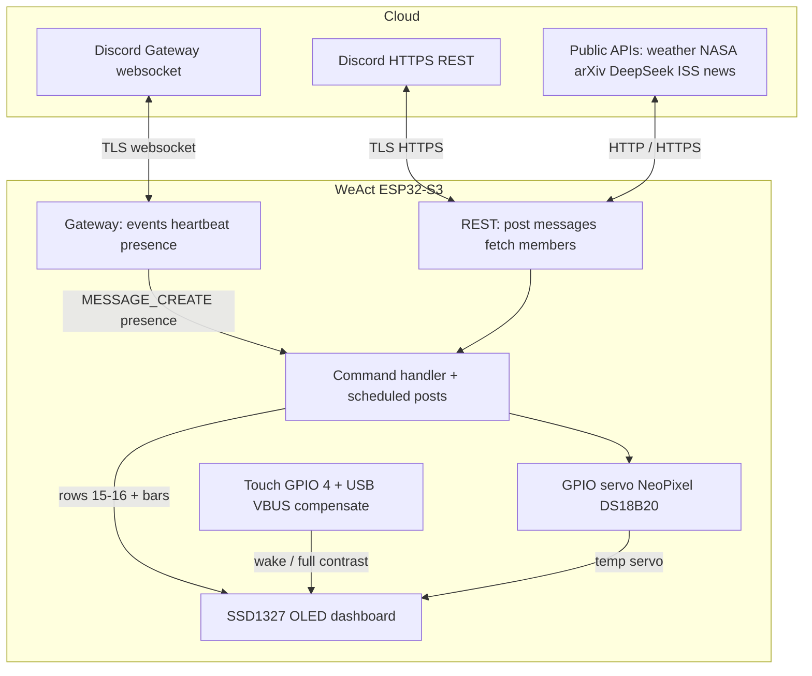

# MiniMe — a Discord bot on ESP32-S3

[](https://github.com/dogma2u/minime-esp32-discord-bot/actions/workflows/compile.yml)

MiniMe is firmware for a **WeAct Studio ESP32-S3-N16R8** that runs a Discord bot on the chip. It joins Wi‑Fi and the Discord Gateway, reads sensors, drives GPIO from chat, and shows a live dashboard on a **128×128 SSD1327** OLED.


*Breadboard prototype: WeAct Studio ESP32-S3-N16R8, 128×128 SSD1327 (GND / VCC / SCL / SDA), two discrete LEDs, GPIO 4 touch wake pad (yellow wire loop), and DS18B20 on GPIO 10. Sensor fail on the OLED is `T:--Error--`.*

Current version: see `VERSION` and `CHANGELOG.md`. License: see `LICENSE` (MIT for original MiniMe files only).

This is my first big modern MCU / Discord bot project on ESP32.  
AI helped with firmware edits, multi-file layout, and GitHub updates. I owned the architecture, wiring, Discord Gateway/OLED design, commands, power/idle trade-offs, and what shipped on the board.

## Ongoing project

MiniMe is still in progress. Working board firmware is on this repo; more hardware and features are planned:

- **Wireless firmware updates** — update the ESP32 over the network without a USB cable each time
- **Mention / DM indicators on `set1` / `set2`** — drive those outputs when a configured user ID (normally `OWNER_ID_STR`) is @mentioned or receives a direct message (desk LEDs or similar)
- **PCB and desk case** — move off the breadboard onto a custom board and enclosure that can sit on my desk

---

## What this bot can do

Same list Discord shows for `!help`:

**Public commands** (DMs, `TARGET_CHANNEL_ID`, or `TARGET_CHANNEL_ID1`):

- `!apod` — NASA Astronomy Picture of the Day
- `!ask <question>` — DeepSeek text reply in chat
- `!display <text>` — writes payload text on OLED rows 15–16 (not the `!display` word)
- `!help` — this command list
- `!iss` — International Space Station position
- `!news` — space / high-tech headlines
- `!physics` — latest arXiv physics papers
- `!sysinfo` — uptime, free heap (internal + 8MB PSRAM), Wi‑Fi RSSI, gateway, USB VBUS
- `!temp` — indoor DS18B20 temperature
- `!time` — bot local time (US Pacific, DST aware)
- `!weather <zip>` — US ZIP weather (OpenWeatherMap)

**Owner-only** (`OWNER_ID_STR`):

- `!led on/off` / `!led <r> <g> <b>` — RGB NeoPixel (0–255 per channel); GPIO 48; `on` = 255 255 255
- `!servo <0-90>` — servo angle (updates the `Srv:` bar)
- `!set1 on` / `!set1 off` — digital output pin 1
- `!set2 on` / `!set2 off` — digital output pin 2

### Automatic posts

Sent to `TARGET_CHANNEL_ID` (no command needed):

- Every **4 hours:** system diagnostics (first post waits until Gateway is connected)
- Daily at **6:00, 12:00, and 18:00** (Pacific): indoor temperature summary

### Bot Discord presence

MiniMe’s own Discord status (green Online / yellow Idle) in Discord:

- Starts **Online** when the Gateway identifies
- Goes **Idle** after **5 minutes** with no activity
- Returns to **Online** on commands and scheduled posts (touch does **not** set Online)

### `!ask` / DeepSeek

- Request `max_tokens`: **900**
- JSON parse buffer: **12288** bytes
- Discord post cap: **2000** characters (Discord limit)
- HTTPS on the ESP32 can take several seconds
- `!ask` is queued off the Discord Gateway thread; heartbeats keep running while DeepSeek waits

## How it works

Everything below runs on one **ESP32-S3**. Discord stays in the cloud; MiniMe talks to it two ways, paints the OLED, and wakes the panel from a touch pad.



- **Gateway** — live link for chat commands, presence, Online/Idle, heartbeats (must not stall during long HTTPS).
- **REST** — bot posts replies and loads member names; also pulls science/weather/AI over HTTPS/HTTP.
- **OLED** — always the status board; sleep blanks the panel only (Wi‑Fi and Gateway stay up).
- **Touch** — wakes the OLED only; does not change Discord status or fire GPIO commands.

---

## OLED dashboard

The display is a **128×128 SSD1327** grayscale OLED, driven with U8g2 (`U8G2_SSD1327_WS_128X128_F_HW_I2C`). Do not use the EastRising `EA_W128128` constructor on this panel; it shifts the picture so the top of the buffer is not the top of the glass.

Font is **5×7** with 1px padding (**8px** per row). U8g2 `drawStr(x, y)` uses **`y` as the font baseline** (no `setCursor`). Header `y=7` is the top of the panel (pixels ~0–6).

| Row | Baseline y | What it shows |
|---|---|---|
| 0 | 7 | `MiniMe`, `GW:Good` / `GW:Bad`, right-justified `HH:MM:SS` |
| 2 | 15 | `Bot:Online` / `Bot:Idle  ` (left, 10 chars); `Www Mmm dd YYYY` (right, 15 chars, space-padded day, fixed slot) |
| 3 | 23 | `Up:xxxxdxxhxxm T:xxxF/xxxC` (space-padded); sensor fail: `T:--Error--` |
| 4 | 31 | `Sig:` Wi‑Fi RSSI bar |
| 5 | 39 | `Heap:` free memory bar (internal SRAM + 8MB PSRAM) |
| 6 | 47 | `Srv:` servo position bar, **0–90°** (boot commands **45°**, half fill) |
| 7–14 | 55 + row×8 … 111 | Eight user rows: name, `On` / `Idle` / `DND` / `Off`, `Bot:N` (commands in the last 24 hours) |
| 15–16 | 119 / 127 | Command / action text, or `!display` payload. **Blank when idle** |

Empty user slots show `---`. Names come from a startup REST member fetch (nick → global name → username), up to **eight** members. Presence updates from the Gateway. Command counts reset every 24 hours.

Commands and gateway events **do not wipe** the dashboard. They write **rows 15 and 16** only, then those rows clear when the message expires.

### `!display`

- Public command.
- Only the text after `!display` is shown (the command word is not drawn).
- Cap **50** characters: **25** on row 15, **25** on row 16.
- Stays **6 seconds**. A new `!display` overwrites and restarts the 6-second timer.

### Display sleep

After **1 minute** with no real events, contrast **dims over 15 seconds**, then the panel turns **off** (`u8g2.setPowerSave(1)`). That is OLED power-save only. The microcontroller, Wi-Fi, and Discord Gateway keep running.

These **do not** reset the timer: signal / heap / servo bars, clock, uptime/temp on row 3, and the 2-second dashboard refresh.

These **wake** the panel and restart the 1-minute timer: **touch on the wake pad (GPIO 4)**, Discord commands, gateway connect/disconnect, `!display`, scheduled reports, and other status lines on rows 15–16. Presence updates for the eight user rows **do not** wake the panel.

When the OLED is off **and** Discord status is Idle, CPU is **80 MHz**; otherwise **240 MHz**.

---

## Fill in these values

Secrets live in **`MiniMe_Discord_Bot/secrets.h`** (gitignored). No sketch source file holds Wi‑Fi, tokens, or IDs.

1. Copy `MiniMe_Discord_Bot/secrets.example.h` → `MiniMe_Discord_Bot/secrets.h`
2. Edit `secrets.h` with your real values (template below).

```cpp
#define WIFI_SSID            "ssid"
#define WIFI_PASSWORD        "password"
#define BOT_TOKEN            "bot token"
#define WEATHER_API_KEY      "WEATHER_API_KEY"
#define NASA_API_KEY         "NASA_API_KEY"
#define DEEPSEEK_API_KEY     "DEEPSEEK_API_KEY"
#define BOT_GUILD_ID         "GUILD_ID"  // startup member fetch
#define OWNER_ID_STR         "OWNER_ID_STR"         // GPIO / servo
#define TARGET_CHANNEL_ID    "TARGET_CHANNEL_ID"    // commands + auto posts
#define TARGET_CHANNEL_ID1   "TARGET_CHANNEL_ID1"   // second command channel
```

Use `#define` (not `const char*`) so every `.cpp` can include `secrets.h` without linker “multiple definition” errors.

| Field | Used for |
|---|---|
| `WIFI_SSID` / `WIFI_PASSWORD` | ESP32 station Wi‑Fi |
| `BOT_TOKEN` | Discord Gateway + REST |
| `WEATHER_API_KEY` | OpenWeatherMap `!weather` |
| `NASA_API_KEY` | NASA APOD for `!apod` |
| `DEEPSEEK_API_KEY` | DeepSeek for `!ask` |
| `BOT_GUILD_ID` | One guild to load members from at boot (numeric snowflake) |
| `OWNER_ID_STR` | Who can run LED / set1 / set2 / servo |
| `TARGET_CHANNEL_ID` | Commands + auto sysinfo / scheduled summaries |
| `TARGET_CHANNEL_ID1` | Second channel where commands are allowed |

IDs are **digits only**. Paste them as C strings, for example `"123456789012345678"`.

Boot loads OLED names from `BOT_GUILD_ID` and from the guilds of `TARGET_CHANNEL_ID` and `TARGET_CHANNEL_ID1` (so both servers get names). Duplicate users are stored once. Slots are split across those guilds, then any leftover rows are filled.

**Expand the sections below** for Discord bot token, owner/channel/guild IDs, and API key steps (OpenWeatherMap, NASA, DeepSeek).

<details>
<summary><strong>How to get a Discord bot token (<code>BOT_TOKEN</code>)</strong></summary>

1. Open [Discord Developer Portal](https://discord.com/developers/applications) and sign in.
2. **New Application** → name it (for example MiniMe) → Create.
3. Left sidebar: **Bot**.
4. If there is no bot yet, click **Add Bot**.
5. Under **Token**, click **Reset Token** / **Copy**. That string is `BOT_TOKEN` in `secrets.h`.
6. Treat it like a password. Anyone with it can control the bot.
7. Enable these **Privileged Gateway Intents** (this firmware uses them):
   - **Message Content Intent**
   - **Server Members Intent**
   - **Presence Intent**
8. Identify intents value in firmware: `37635` (guilds, members, presences, guild messages, DMs, message content). `large_threshold` is `250`.

### Invite the bot to your server

1. Developer Portal → your app → **OAuth2** → **URL Generator**.
2. Scopes: `bot`.
3. Bot permissions (minimum):
   - View Channels
   - Send Messages
   - Read Message History
4. Copy the generated URL, open it in a browser, pick your server, authorize.
5. In Discord, the bot stays offline until the ESP32 connects.

</details>

<details>
<summary><strong>How to get your owner ID (<code>OWNER_ID_STR</code>)</strong></summary>

This is **your Discord user ID**, not the bot’s ID.

1. Discord: **User Settings** → **Advanced** → enable **Developer Mode**.
2. Right-click **your own avatar** → **Copy User ID**.
3. Paste that into `OWNER_ID_STR` in `secrets.h`.

If owner commands never work, you copied a channel ID or the application ID by mistake.

</details>

<details>
<summary><strong>How to get channel and guild IDs</strong></summary>

Developer Mode must be on.

- **Channel:** right-click the text channel → **Copy Channel ID**. Use one for `TARGET_CHANNEL_ID` (auto reports) and optionally another for `TARGET_CHANNEL_ID1`.
- **Guild / server:** right-click the server icon → **Copy Server ID**. That is `BOT_GUILD_ID`.

The bot must be able to **see and send** in those channels.

</details>

<details>
<summary><strong>How to get an OpenWeatherMap key (<code>WEATHER_API_KEY</code>)</strong></summary>

1. Create a free account at [OpenWeatherMap](https://home.openweathermap.org/users/sign_up).
2. Sign in → [API keys](https://home.openweathermap.org/api_keys).
3. Copy the default key, or generate one.
4. Paste it into `WEATHER_API_KEY` with **no extra spaces**.
5. New keys can take up to a few hours to activate.
6. `!weather` uses Current Weather Data with `zip={zip},US` and `units=imperial`.

</details>

---

## Science / physics commands

These are public. Digests are short so the ESP32 stays within memory limits.

| Command | Source | Key? |
|---|---|---|
| `!news` | [Spaceflight News API](https://api.spaceflightnewsapi.net/) — 3 space / high-tech headlines | No |
| `!physics` | [arXiv](https://arxiv.org/) `cat:physics` — 3 newest papers | No |
| `!apod` | [NASA APOD](https://api.nasa.gov/) — title, short explanation, image URL | Yes |
| `!iss` | [Open Notify](http://open-notify.org/) — ISS latitude / longitude | No |

<details>
<summary><strong>How to get a NASA key (<code>NASA_API_KEY</code>)</strong></summary>

1. Open [api.nasa.gov](https://api.nasa.gov/) and generate a free key (email signup).
2. Paste it into `NASA_API_KEY`.
3. NASA’s `DEMO_KEY` works for light testing but is shared and rate-limited. Use your own key if `!apod` starts failing.

</details>

<details>
<summary><strong>How to get a DeepSeek key (<code>DEEPSEEK_API_KEY</code>)</strong></summary>

1. Create an account at [DeepSeek Platform](https://platform.deepseek.com/).
2. Open [API Keys](https://platform.deepseek.com/api_keys).
3. Create a key and copy it.
4. Paste it into `DEEPSEEK_API_KEY`.
5. In Discord: `!ask what is quantum entanglement?`
6. Replies are capped at **2000** characters (Discord limit). HTTPS on the ESP32 can take several seconds.

</details>

---

## Hardware (default pins)

This board: **WeAct Studio ESP32-S3-N16R8** (**16MB flash**, **8MB PSRAM**).

Display: **SSD1327**, **128×128** pixels, I2C.

| Device | GPIO |
|---|---|
| RGB NeoPixel (1×, GRB; `!led`) | 48 |
| Servo | 47 |
| Digital out 1 (`!set1`) | 6 |
| Digital out 2 (`!set2`) | 7 |
| DS18B20 data | 10 |
| OLED SSD1327 (128×128) SDA | 8 |
| OLED SSD1327 (128×128) SCL | 9 |
| Touch wake pad | 4 |
| USB VBUS ADC (divider) | 1 |

OLED module labels: **GND, VCC, SCL, SDA**. The panel is **128×128**. Change pins in `config.h` if your wiring differs.

### RGB NeoPixel (GPIO 48)

One WS2812-style pixel (`NEO_GRB`). Owner-only:

- `!led on/off` — white (255, 255, 255) / off (0, 0, 0)
- `!led <r> <g> <b>` — set red, green, blue each **0–255** (example: `!led 255 0 0` red)

### DS18B20 (GPIO 10)

TO-92, powered from **3.3 V** (not parasitic). Firmware enables the ESP32 **internal pull-up** on GPIO 10. A **4.7 kΩ** resistor from **DQ to 3.3 V** is still recommended; the internal pull-up is weak.

| TO-92 lead (flat toward you, leads down) | Connect to |
|---|---|
| Left | GND |
| Middle (DQ) | GPIO 10 |
| Right (VDD) | 3.3 V |

`!temp` and scheduled indoor summaries use this sensor. If it is missing or the bus fails, Discord replies `Temperature sensor error.` and the OLED shows `T:--Error--`.

---

## Touch wake pad (GPIO 4)

The ESP32-S3 has a **built-in capacitive touch sensor** on **GPIO 4** (`TOUCH4`). MiniMe uses it to wake the OLED when the panel has dimmed or turned off. No Discord command is required — tap the pad like a light switch.

### Wiring

1. Connect a **conductive pad** to **GPIO 4** on the ESP32-S3:
   - Copper tape, a short wire, a small metal plate, or a spring contact all work.
   - Solder or screw the pad lead to the **GPIO 4** header pin (or a breadboard row tied to GPIO 4).
2. **No external resistor or pull-up** is needed. Touch sensing uses the chip’s internal capacitive front end.
3. **Ground reference:** a finger touching the pad (or a grounded metal bezel) completes the capacitive path. Mount the pad where you can reach it when the display is asleep.
4. Keep the touch lead **short** and away from noisy switching loads (servo, NeoPixel) if possible. Long loose wires pick up noise and can false-trigger.

### USB VBUS monitor (GPIO 1)

USB port voltage moves the raw touch numbers. MiniMe reads VBUS through a **divider** and scales touch samples to the voltage measured at boot, so the trip gap stays constant.

1. **Do not** connect USB 5V directly to GPIO 1 (max ~3.3 V on the pin).
2. Wire: **USB 5V (VBUS)** → **10 kΩ** → **GPIO 1** → **10 kΩ** → **GND**.
3. Change `PIN_USB_VBUS_ADC` / `USB_VBUS_R_HI` / `USB_VBUS_R_LO` in `config.h` if your divider or pin differs.
4. `!sysinfo` reports **USB VBUS** in volts to millivolt resolution (about **5.000 V** with a 1:1 divider on a healthy 5 V port). An unwired pin will read junk; compensation is skipped if the reading is below **1000 mV**. The ADC is sampled at most every **500 ms**.

### How it works in firmware

- **`PIN_TOUCH`** is **4** (change in `config.h` if you use a different touch-capable GPIO).
- At boot, **`setupTouch()`** runs **after Wi-Fi and I2C**. It samples USB VBUS, then fills a **16-sample rolling average** of voltage-compensated idle touch readings (`touchIdleAvg`).
- Trip is always **`touchIdleAvg + TOUCH_THRESHOLD`** (default gap **2000**). Idle samples below trip keep updating the rolling window; a tap does not.
- **`loop()`** calls **`pollTouchWake()`** (no touch interrupt). A rising edge, after a **300 ms** debounce, uses the same wake path as a Discord event (full contrast, 1-minute idle timer restarted).
- Serial logging / touch debug is **removed** from the firmware (not just commented out).

### Tuning sensitivity

If the pad is **hard to trigger**, decrease **`TOUCH_THRESHOLD`** (default **2000**).

If it **false-triggers** or stays “touched” when idle, **increase** the threshold or use a **smaller pad**.

After changing the threshold, re-upload and tap the pad: the OLED should wake only on a real touch.

### What touch does *not* do

- Touch **only wakes the OLED**. It does not send Discord messages, set Discord Online/Idle, move the servo, or change GPIO outputs.
- The ESP32, Wi-Fi, and Gateway **never sleep** — only the display blanks to save the panel.

---

## Arduino IDE setup

GitHub Actions compiles this sketch on every push to `master` (see the **Compile** badge at the top). That checks a clean build only; it does not upload to the board. Your breadboard photo and Discord use still prove it runs.

1. Install [Arduino IDE](https://www.arduino.cc/en/software) and the **esp32** board package (Espressif).
2. Board: **ESP32-S3**. This hardware is a **WeAct Studio ESP32-S3-N16R8** (N16 = 16MB flash, R8 = 8MB PSRAM).
3. Tools: enable **OPI PSRAM** (8MB) and a **16MB** flash partition scheme that matches the N16R8.
4. Libraries (Library Manager):
   - WebSockets (by Markus Sattler)
   - ArduinoJson
   - U8g2
   - OneWire
   - DallasTemperature
   - Adafruit NeoPixel
   - NTPClient
5. Open `MiniMe_Discord_Bot/MiniMe_Discord_Bot.ino` (Arduino IDE loads all `.cpp` files in that folder automatically).
6. Copy `secrets.example.h` to `secrets.h` and fill in Wi‑Fi, token, keys, and IDs.
7. Upload. The firmware has no Serial logging; use Discord `!help` and the OLED to confirm it is running.
8. In Discord, try `!help`. Tap the GPIO 4 pad to wake the OLED after it dims off.

Do not enable `heap_caps_malloc_extmem_enable` for small allocations. Wi‑Fi / TLS in PSRAM can crash this board. Gateway JSON (`256KB`) is allocated in PSRAM on purpose.

---

## Safety

- Never commit firmware that contains a live bot token, API key, password, or Discord snowflake ID.
- If a token leaks, reset it in the Developer Portal immediately.

---

## License

Original MiniMe source, README, changelog, and photos in this repo are under the **MIT License**. See `LICENSE`.

That grant does **not** cover Arduino/ESP32 libraries, U8g2, Discord, or other APIs. Those stay under their own licenses and terms. You still have to install the libraries listed under **Arduino IDE setup** and follow each service’s rules for keys and bots.
